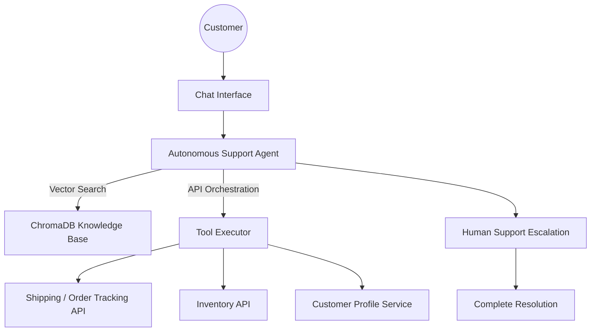

# 🌟 **Autonomous Customer Service Agent for E-Commerce**
### *AI-powered support that works 24/7 — faster, smarter & fully autonomous.*

  
  
  
  
  

---

## 🛒 **Transforming E-commerce Support**
Traditional platforms struggle to deliver fast responses, resolve order issues, and scale support teams efficiently.  
**Our intelligent autonomous agent eliminates delays, automates resolutions, and ensures exceptional customer satisfaction.**

---

## 🚩 **Problem**
E-commerce businesses face major challenges:
- ❌ Lack of 24/7 support  
- ❌ High wait time for order status & returns  
- ❌ Repetitive workload for human support  
- ❌ Poor customer satisfaction (CSAT)

---

## 🎯 **Project Goal**
Build an **AI-powered autonomous agent** that:
- 💬 Handles **order tracking, returns & FAQs** automatically  
- 🔗 **Orchestrates multi-step tool & API execution**  
- 🧠 **Learns from previous support cases**
- 📚 Uses **RAG-based knowledge retrieval**
- 👨‍💼 **Escalates complex cases** to human agents with full chat history

---

## 🧠 **Key Capabilities**
| Capability | Description |
|-----------|-------------|
| 🤖 Autonomous Chat Agent | No manual support required |
| 📦 Real-time Order Tracking | Live status via logistics API |
| 🔄 Return & Replacement Workflow | Automated return initiation |
| 📚 Knowledge Retrieval (RAG) | Vector search over FAQs |
| 🧠 Learning from Ticket History | Continuous improvement |
| 👨‍💻 Smart Human Handoff | Context-aware escalation |
| 🌐 Multi-Platform Integration | Web / App / WhatsApp / Email |

---

## 🧱 **System Architecture**

## 💼 **Tech Stack**

| Category | Technology |
|----------|-----------|
| 🧠 LLM | **Gemini-2.5-Flash-Lite** |
| 🗂 Vector Database | **ChromaDB** |
| 🖥 Backend | **Python** |
| 🌐 Frontend | **Streamlit / React UI** |
| 🔧 Tooling & APIs | **Shipping API / Inventory API / CRM API** |
| 📚 Knowledge Layer | **RAG + Embeddings** |
| 🚀 Deployment | **Docker / Kubernetes / Kaggle** |

---

## 📸 **Screenshots**

### 🖼️ Project Demonstration

